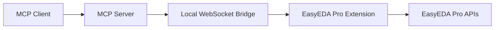

# Architecture

You do not need this page for setup. Use it when you want to understand how the bridge works.

## One-Line Version

The MCP client talks to a local Node.js server. The server talks to an EasyEDA Pro extension over WebSocket. The extension reads the open EasyEDA Pro project through `eda.*` APIs.



## Main Parts

### MCP Server

Entrypoint:

```text
src/index.ts
```

Responsibilities:

- expose MCP tools over `stdio`
- validate tool inputs
- start the local WebSocket bridge
- return structured tool results

### WebSocket Bridge

File:

```text
src/bridge/EasyEdaBridge.ts
```

Default endpoint:

```text
ws://127.0.0.1:8765
```

Responsibilities:

- wait for the EasyEDA Pro extension
- track connection status
- ack the extension's 5 s heartbeat
- send method calls to the extension
- enforce timeouts
- report compatibility problems (bridge protocol `0.2.0`)
- if the port is taken, stay up, report it through the tools, and retry every 5 s

### Tool Layer

File:

```text
src/mcp/registerTools.ts
```

Responsibilities:

- define MCP tool names
- define schemas
- route read-only calls
- gate mutating calls behind an exact `CONFIRM <action>` confirmation
- write export files returned by the extension (`src/mcp/exportFiles.ts`)

### EasyEDA Pro Extension

Main file:

```text
extension/src/index.ts
```

Responsibilities:

- connect to the local WebSocket bridge and reconnect on its own
- receive bridge calls
- call EasyEDA Pro `eda.*` APIs
- open each schematic page when reading all pages, then restore the user's document
- return editor data and export file contents to the MCP server

### Schematic Analysis

File:

```text
src/schematic/analysis.ts
```

Responsibilities:

- normalize components, pins, wires, labels, and nets
- compute connectivity per page and merge named nets and multi-part components across pages
- trace nets and components
- find unconnected pins
- validate schematic areas
- verify connection assertions

## Request Flow

When an AI client calls a tool:

1. MCP client calls the local server
2. server validates the tool input
3. server sends a bridge method over WebSocket
4. EasyEDA Pro extension receives the method
5. extension calls EasyEDA Pro APIs
6. result returns to the server
7. server returns the result to the MCP client

## Why It Works This Way

This architecture keeps the system local and live:

- no project export is required for normal inspection
- exports never open an EasyEDA save dialog; the server writes the file
- the AI sees the project that is actually open
- EasyEDA-specific API calls stay inside the extension
- MCP clients get a stable tool interface

## Current Limits

- EasyEDA Pro must be running
- the extension must stay connected
- MCP clients may need a restart after new tools are added
- offline `.epro` parsing is not part of this version
