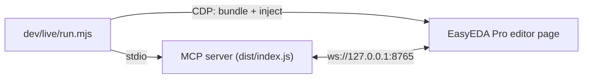

# Live Development with EasyEDA Pro in Docker

Unit tests cover the MCP server and the analysis code, but the extension talks to a real EasyEDA Pro. This setup runs EasyEDA Pro 3.2.149 in Docker and hot-loads the extension from `extension/src`, so a change is live in about a second instead of a rebuild and `.eext` reinstall.

You need Docker and an EasyEDA Pro activation file (the one the desktop client asks for on first start).

## How It Works



- `dev/live/Dockerfile` installs the official Linux client (SHA-256 pinned) under Xvfb and starts it with the Chrome DevTools Protocol on the container's loopback. No port is published to the host.
- Dev tools run in a Node sidecar (`dev/live/node.sh`) that shares the container's network namespace, so CDP (`127.0.0.1:9222`) and the bridge (`127.0.0.1:8765`) are both local to it.
- `dev/live/inject.mjs` bundles `extension/src/index.ts` with the same esbuild settings as `npm run build:extension` and evaluates it in the editor page with `eda` bound to the Pro API root. Pro only grants `sys_WebSocket` to installed extensions with external interaction enabled, so injected code uses the page's native WebSocket; every other `eda.*` call is the real API. Injecting again calls the previous instance's `deactivate()` first.

## First Start

```bash
npm ci && npm run build
EASYEDA_PRO_ACTIVATION_FILE=/path/to/activation.txt dev/live/pro-up.sh
dev/live/node.sh node dev/live/setup.mjs      # activates the client once
```

The first `pro-up.sh` builds the image (downloads the ~400 MB client). The activation file is mounted read-only; EasyEDA Pro copies it into its profile, which lives in the Docker volume `easyeda-mcp-live-home`. Remove that volume when you are done if the machine is shared.

Open a project to test against. It must be under `dev/live/.work/` (gitignored, mounted at `/work`):

```bash
cp ~/Designs/MyBoard.eprj2 dev/live/.work/
dev/live/open-project.sh dev/live/.work/MyBoard.eprj2
```

## The Loop

```bash
# edit extension/src/*.ts or src/**/*.ts, then:
npm run build                                   # only if src/ changed (server side)
dev/live/node.sh node dev/live/run.mjs dev/live/calls/schematic.json
```

`run.mjs` starts the MCP server over stdio, injects the current extension source, waits for the bridge (about 0.3 s) and runs the tool calls in the JSON file. Each call prints a status line and a preview; full results go to `dev/live/.work/results/`. It also flags any modal dialog a call leaves open in EasyEDA Pro — some API misuse is only reported that way, and such calls never resolve.

A calls file is an array of `[toolName, arguments?, previewChars?]`:

```json
[["easyeda_get_context"],
 ["easyeda_verify_connections", {"checks": [{"type": "pin_on_net", "component": "U1", "pin": "10", "net": "GND"}]}, 800]]
```

Other helpers (run through `dev/live/node.sh node ...` unless noted):

| Script | Use |
| --- | --- |
| `dev/live/eval.mjs '<js>'` | Run a snippet with `eda` bound, e.g. `'await eda.dmt_EditorControl.openDocument("<uuid>")'` |
| `dev/live/inject.mjs` | Inject without starting a server (e.g. to test reconnects against a server you run yourself) |
| `dev/live/ui.mjs "<text>" ... shot:<png>` | Click UI elements by visible text; take screenshots |
| `dev/live/dump-raw.mjs > dev/live/.work/raw.json` | Dump the per-page schematic data the extension collects |
| `node dev/live/compare-netlist.mjs <raw.json> <netlist.enet>` (host) | Compare the schematic analysis with EasyEDA Pro's own netlist export |
| `dev/live/window.sh` (host) | Resize the window to 1920x1080 so extension header menus are not folded |

### Checking analysis against EasyEDA

`compare-netlist.mjs` is the accuracy check for schematic changes. Export the netlist from the PCB (`easyeda_export_netlist` with the PCB open), dump the schematic data, then:

```bash
npm run build
node dev/live/compare-netlist.mjs dev/live/.work/raw.json dev/live/.work/board.enet
```

It treats connectivity as a partition of pins and reports nets the snapshot splits or merges, name mismatches and pins missing on either side; it exits non-zero on any discrepancy.

## Driving the Editor from Code

For interactive work keep a daemon running next to Pro and use the CLI (or the Python client) from sidecars; they share the hub token through `dev/live/.work/config`:

```bash
npm run build
docker run -d --name easyeda-mcp-daemon --network container:easyeda-mcp-live \
  -u "$(id -u):$(id -g)" -e HOME=/tmp -e EASYEDA_MCP_CONFIG_DIR=/repo/dev/live/.work/config \
  -v "$PWD":/repo -w /repo node:22-slim node dist/index.js daemon
dev/live/node.sh node dev/live/inject.mjs          # or rely on an installed extension
E="dev/live/node.sh node dist/cli/index.js"
$E status
$E pcb snapshot --include components,tracks --out /repo/dev/live/.work/board.json
$E pcb move U1 --dx 50
$E pcb drc
$E render --designator U1 --out /repo/dev/live/.work/u1.png
```

`dev/live/run.mjs` started while the daemon runs uses it through the hub (proxy mode) instead of starting its own bridge. Hot-loading parks an installed copy of the extension (otherwise the two keep replacing each other's connection); `MCP Bridge -> Reconnect` resumes it.

### Where the time goes

Measured on EasyEDA Pro 3.2.149 with a 79-part, 2-layer board:

| Step | Time |
| --- | --- |
| Container start / editor ready (already activated) | 0.2 s / 2.8 s |
| Open a local project (`open-project.sh`; Recent Design / file dialog) | 2.2 s / 3.5 s |
| Hot-load the extension and connect | 0.03 s + 0.3 s |
| CLI command incl. `docker run` of the sidecar | ~0.26 s (the call itself is mostly < 50 ms) |
| `pcbSnapshot` (all parts, 400 KB JSON) | 34 ms |
| Move a component (modify + read back) | 30–60 ms |
| DRC | 0.37 s |
| Schematic snapshot of 3 pages (opens each page) | 0.5–1.5 s |
| Zoomed PNG render (no settle wait needed) | 0.09 s |
| Exports (BOM, netlist, Gerber, PDF) | 0.3–0.5 s |
| New MCP process reaching the extension via the hub (proxy) | 4 ms |
| Owner stops → successor owns the port → extension connected | 20 ms → ~0.1 s (was ~19 s) |
| Owner crashes (no `bye`) → extension notices | ≤ 10 s |
| `easyeda package --preset all --zip` (20 files) / `easyeda check` | 8.4 s / 2.9 s |

Activation is stored in the `easyeda-mcp-live-home` volume, so it happens once.

## Release Check with the Real Package

Injection skips the parts only an installed extension exercises: `sys_WebSocket`, the external-interaction permission, header menus and startup activation. Before a release, install the package once:

```bash
npm run setup:local
dev/live/install-eext.sh            # Extensions Manager > Import, like a user
```

Then check, with an MCP server running in the sidecar:

1. right after install (permission off) nothing connects: EasyEDA Pro does not activate an extension on install
2. ticking "Allow interactive with external" connects within a few seconds without a menu click (`onChangeAllowExternalInteractions`)
3. `MCP Bridge -> Show Status` reports `connected` (the menu runs a fresh evaluation of the script, which must see the shared connection state)
4. `docker restart easyeda-mcp-live` → the extension connects on startup (`onStartupFinished`)
5. restarting the MCP server → the extension reconnects within about 20 s

All five passed for 0.2.0 on EasyEDA Pro 3.2.149.

EasyEDA Pro evaluates the extension entry again for every activation event and menu command, so module-level variables do not persist; the extension keeps its connection state on a page global (`easyedaMcpBridgeRuntime`). Hot-loaded code uses a separate key.

## Cleanup

```bash
docker rm -f easyeda-mcp-live
docker volume rm easyeda-mcp-live-home   # removes activation and settings
```
